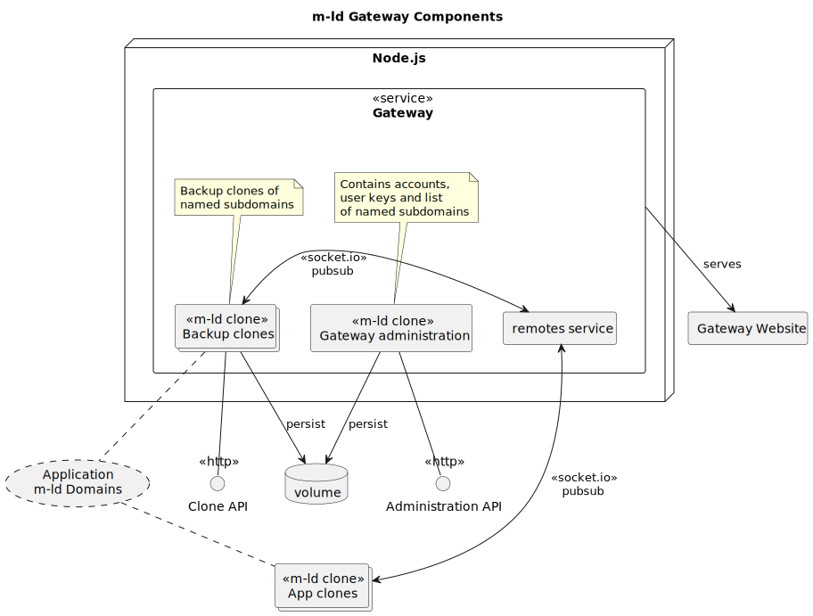

# gateway architecture

The **m-ld** Gateway is a software service to be deployed on a server node. Following the [manifesto for live sharable data](https://m-ld.org/topics/news/live-and-sharable), it manages all its data locally, persisting it to a configured volume. (Among other advantages, this pattern will allow the Gateway to be clustered in future, pending only [support in the Socket.io remotes service](https://github.com/m-ld/m-ld-gateway/issues/2).)

The Gateway's own data, which primarily comprises user accounts, is stored in a dedicated administration _domain_ (see the [m-ld documentation](https://m-ld.org/doc/) for definitions of the terms _domain_ and _clone_). Consumers of the Gateway are applications that use their own **m-ld** domains for (some subset of) their data. Application domains may choose to only use the Gateway's message-passing "remotes" service; or may additionally back-up named domains on the Gateway. In the latter case, the application domains are _cloned_ on the Gateway and persisted in the volume.

The sub-folders of this architecture folder contain viewpoints on the architecture primarily for communication within the team. User documentation can be found in the repository `doc` folder, which also comprises the content of the embedded website which is served by the Gateway when deployed. Our own cloud [Gateway deployment can be viewed at gw.m-ld.org](https://gw.m-ld.org/).

## design notes
