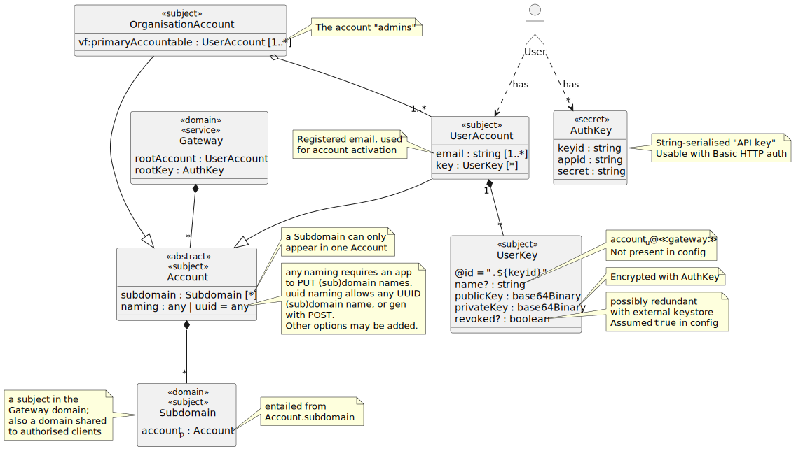

# Gateway Security

An overview of the Gateway architecture can be found in the [parent folder](..).

This security specification applies to the Gateway service, whose source code is found in this repository.

Security is important to the service and its users, primarily because user data transits the service boundary, either temporarily through the "remotes" messaging, or persisted in backup clones. Note that "users" belong to the applications ("apps") that are the immediate clients of the Gateway service, and so ultimate responsibility for user data must reside with these apps. It is therefore crucial that app developers understand the security consequences of using a Gateway as part of their app's architecture.

> 🚧 Note that the Gateway is currently marked as [WIP – Initial development is in progress, but there has not yet been a stable, usable release suitable for the public.](https://www.repostatus.org/#wip) 

## Threats and Risk Assessment

Key to mitigations in the table below:
- ✔︎ Available by design, with suitable configuration
- 🚧 Coming soon; please indicate your needs in the [Issues](https://github.com/m-ld/m-ld-gateway/issues)
- ☁️ Responsibility of the deployed environment and/or the app

| Threat               | Impact                            | Likelihood      | Mitigations                                                            |
|----------------------|-----------------------------------|-----------------|------------------------------------------------------------------------|
| Unauthorized Access | High: Compromise of user privacy, data leakage. | Moderate-High | ✔︎ Authentication 🚧 Account lockouts ☁️ Intrusion detection     |
| Eavesdropping       | Moderate: Exposure of sensitive conversations. | Moderate       | ☁️ Secure communication protocols                                      |
| Data Loss or Corruption | High: Loss of user messages and backup data. | Low-Moderate  | ✔︎ ☁️ Regular backups ✔︎ Redundancy 🚧 Data integrity checks     |
| Insider Threat      | High: Unauthorized access to user data. | Low-Moderate  | ✔︎ Access controls ☁️ Monitoring ☁️ Principle of least privilege |
| Phishing            | Moderate: Unauthorized access to user accounts. | Moderate       | ☁️ User education ✔︎ ☁️ Multi-factor authentication         |
| Brute Force Attacks | Moderate: Unauthorized access to accounts. | Low-Moderate  | 🚧 Account lockouts ☁️ CAPTCHA ✔︎ Strong password policies       |
| DoS Attacks         | High: Service unavailability.     | Low-Moderate  | ☁️ DDoS protection 🚧 Load balancing 🚧 Rate limiting            |
| Data Breach         | High: Exposure of sensitive backup data. | Low-Moderate  | ✔︎ Strong encryption ✔︎ Access controls ☁️ Security audits       |
| Insecure Key Management | High: Unauthorized decryption of data. | Low-Moderate  | ✔︎ Strong encryption 🚧 Regular key rotation                        |

## Authentication and Authorization

Certain information is provided by the Gateway without authentication or authorization: this comprises its published website content, and the root account's public key for validating signed information.

All access to app data is mediated by means of Gateway _accounts_. Accounts can represent users or apps. In the latter case, the account is like an "admin" user for the app. App data is accessible via the remotes messaging service (Socket.io), the Clone API (HTTP) and the Administration API (HTTP). The diagram introduces the main classes involved in account management and access control.

By default, app data is only accessible to an agent with knowledge of the account _key_ (`AuthKey`), which is a string having at least 272 bits of securely random content. This can be used as the "password" component of an HTTP Basic Authorization header. Note this also applies to the establishment of a Socket.io connection.

> 🚧 Soon, it will also be possible to use HTTP Bearer authorization and possibly other authorization schemes. Please provide feedback on [this ticket](https://github.com/m-ld/m-ld-gateway/issues/10).

It is possible to remove the requirement for authorization in the remotes messaging service (Socket.io) by making a setting change to the account (`remotesAuth`). Note that this setting only applies to this service, and is restricted to a particular pattern of subdomain names (see [UUID Subdomains](../../doc/uuid-subdomains.md)).

All app data is also accessible to the Gateway "root" account, which is required for server startup. The root account key must be kept safe by the Gateway administrator.

> 🚧 In production it will be necessary to rotate account keys regularly. We will provide support for this soon. Please provide feedback on this in the [Issues](https://github.com/m-ld/m-ld-gateway/issues).

## Secure Remotes Messaging

Access to the remotes messaging service requires an account key, unless this has been disabled by the account owner, see [above](#authentication-and-authorization).

The remotes messaging service is implemented using Socket.io, over HTTP and Websockets. The deployment environment should be set up to apply TLS to these protocols (thus, HTTPS and WSS), to protect against message interception and tampering.

## Data Backup and Storage

All account data is stored on a file system volume attached to the Gateway server, in a configured location. The deployment environment should apply security controls to this location as required for data integrity and availability, such as access controls, encryption and backup/restore.

Note that data in app domains is inherently distributed to app instances via **m-ld** clones. Apps can therefore make additional provisions for data backup by persisting their clones' data, e.g. by [using LevelDB](https://js.m-ld.org/#data-persistence). This is particularly important if the Gateway is not being used for backups.

## Personal Data Handling

Accounts in the Gateway are created by selecting an account name and requesting an activation code by email. The email provided is retained by the Gateway. It can be removed by the account holder (although doing so removes the possibility to obtain a replacement account key if one has been lost or compromised).

App domains contain app data, which could include app end-user personal data. It is the app's responsibility to ensure that such data is handled correctly, e.g.:

- Compliance with relevant data protection regulations (e.g., GDPR, CCPA).
- Privacy-by-design principles in software development.
- Data breach notification procedures and timelines.
- Third-party data sharing and data processing agreements, if applicable.

The Gateway operator should make a suitable liability statement if necessary. (E.g. m-ld.io Ltd. provides a [privacy statement](https://m-ld.org/privacy/) applicable to the online Gateway at gw.m-ld.org.)