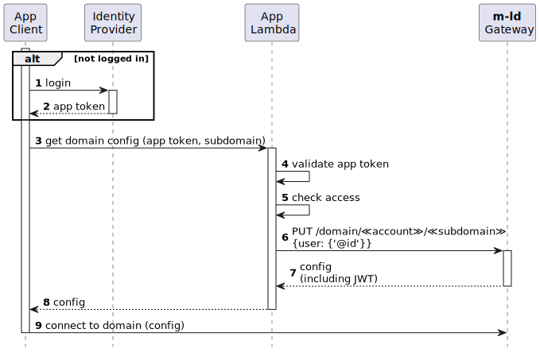

# Accounts

Accounts have two purposes in the **m-ld** Gateway.
1. To represent human and machine users. For this purpose, users and machines will get _keys_, which can include asymmetric keys for digital signatures. Note that registering all users as individual accounts is optional, and apps can be built using the Gateway having only one "app" account and key, with the app's users managed by the app itself.
2. To provide a container for **m-ld** domains. Domains belong to an account, which contributes its name to the domain's name. That's why domains in the Gateway are sometimes called "subdomains". Subdomains can be [_named_](named-subdomains) – the domain is first created in the Gateway and is backed-up there; or have [_UUID_ identifiers](uuid-subdomains) – in which case the Gateway only provides message delivery.

To create an account you can use an activation code, or (if the Gateway is self-hosted) the root account.

Account names (`≪account≫` in the below) must be composed only of **lowercase** letters, numbers, hyphens `-` and underscores `_`.

## creating an account with an activation code

First, request an activation code with an email address.

```

```

The body of the response will have the form `{ "jwe": "≪base64Binary≫" }`. The value of the `jwe` key will be used in the next step.

An email will be sent to the given address, containing a six-digit activation code.

The account can then be created with another HTTP request:

```

```

The body of the response will be of the form `{ "auth": { "key": "≪my-key≫" } }`, where `≪my-key≫` is the new account's authorisation key.

## creating an account with the root key

The Gateway root account can be used to create any user account directly.

```

```

The body of the response will be of the form `{ "auth": { "key": "≪my-key≫" } }`, where `≪my-key≫` is the new account's authorisation key.

## remotes authentication options

When [connecting to subdomains](clone-subdomain), clients may need to provide authentication. The following options are available:
- `key` requires the client to know and provide the account key (the default)
- `anon` allows the client not to include any authentication (this can only be used with [UUID subdomains](uuid-subdomains))
- `jwt` requires the client to provide a JWT signed by the account key (see below)

The required option can be set as follows.

```

```

You can also remove a previously-set option by including a delete clause, for example: `{ "@delete": { "remotesAuth": "jwt" } }`.

### using JWT authentication tokens

The `key` authentication option requires the client to have access to the account key. If the current user is the account owner and their code is running in a secure environment, for example under an operating system user account, this may be fine. The `jwt` option allows you to provision short-lived tokens for use in insecure environments, or by users who are not the account owner.

When `jwt` authentication is available, the end-point to [create a named subdomain](named-subdomains) responds with a configuration containing a newly-minted token, valid for 10 minutes.

A typical app design is shown below.



1. The App's Client (e.g. a browser page) performs the necessary steps to log into the app. This is independent of the Gateway and **m-ld**.
2. The app's identity provider will issue some kind of credential, usually itself a token.
3. In order to obtain the necessary configuration and Gateway JWT for cloning the domain, the client needs to exchange the app token for a Gateway token. It does this by calling a serverless lambda (this could also be a straightforward service).
4. The app lambda is able to validate the client's app token according to the rules of the identity provider. It now knows that the user is identified and logged in.
5. The app lambda can also check that the user does in indeed have access to the domain according to the app's access control rules. (This could involve inspection of the app token, and/or another call to the identity provider, if it also supports authorisation.)
6. The app lambda uses its Gateway account key (typically available via an environment variable) to [idempotently PUT the subdomain](named-subdomains#creating-a-named-domain) to the Gateway. If desired, the user identity can be be indicated using a JSON request body of the form `{"user": {"@id": "≪URI≫"}}`, and the identity will be included as the `sub` (subject) of the returned JWT.
7. The Gateway responds with the necessary configuration and a newly minted JWT.
8. The app lambda responds the configuration to the client.
9. The client is now able to connect to the domain using the provided configuration, including its JWT.