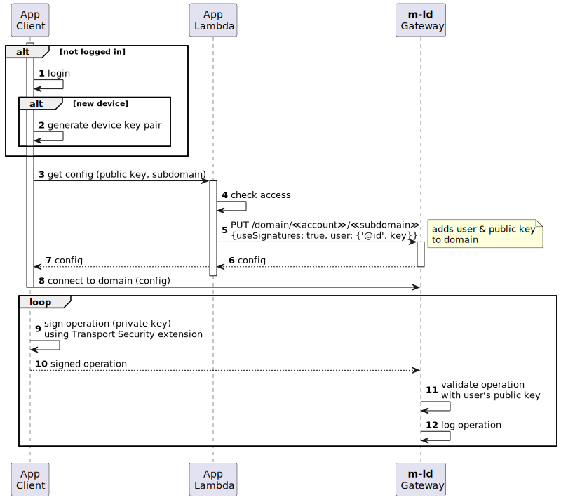

# Signatures

When using [named subdomains](named-subdomains) in the Gateway, it's possible to require that every data update originating from an app user is cryptographically signed. The Gateway will verify the signatures on receipt, and the signed updates can also be emitted to another system in order to implement a non-repudiable auditable log of user activity.

Using signatures requires that each app user possesses an [RSA asymmetric key pair](https://en.wikipedia.org/wiki/RSA_(cryptosystem)). This may issued using a [Public Key Infrastructure (PKI)](https://en.wikipedia.org/wiki/Public_key_infrastructure), but can also be generated on the user's device using, for example, the web browser [Crypto API](https://developer.mozilla.org/en-US/docs/Web/API/Web_Crypto_API).

> ⚠️ Note that securing the private component of an asymmetric key can be subtle and complex. We recommend you use a well-known and proven key distribution mechanism.

Signatures do not require every app user to possess a Gateway account. They are best used in combination with [JWT authentication tokens](accounts#using-jwt-authentication-tokens).

In overview:
- The use of signatures is signalled to the Gateway upon creation of a subdomain.
- Each user's public key is added to the subdomain when requesting the needed configuration to clone the subdomain.
- Local clones of the subdomain must be initialised with a suitable Transport Security extension which applies signatures to **m-ld** protocol messages.

## app flow

The sequence diagram shows an example of the steps required to both initiate and apply signatures, for a user interacting with a Gateway subdomain.



1. The user logs into the app (perhaps using an Identity Provider).
2. If this device has not been used by this user before, the app generates a key pair (note, this requires a means to store the private component securely on the device).
3. The app makes a call to a lambda which is responsible for creating the requested subdomain if it does not already exist. It's also possible to design an app that has no such lambda, providing some other way to securely make calls to the Gateway on behalf of the account owner.
4. The lambda checks the user has suitable privileges to create or access the subdomain.
5. When calling the idempotent PUT of the subdomain, the lambda includes the user's identity in the request body (see below).
6. The subdomain configuration is returned to the lambda
7. ... and forwarded to the client,
8. ... which uses it to clone the subdomain, applying a suitable Transport Security extension (see below).
9. **m-ld** uses the Transport Security extension to sign each protocol message.
10. The signed messages are broadcast, including to the Gateway.
11. The Gateway validates each signature using the public key associated with the user.
12. The Gateway logs signed data updates.

## adding public keys to subdomains

Requesting the idempotent PUT of a subdomain [(see also Named Subdomains)](named-subdomains#creating-a-named-domain) creates the subdomain if it does not already exist, and returns the configuration details for cloning it. When making this request, you can pass a JSON object with the end-user's details, as follows.

```

```

The parameter details are:
- `useSignatures` indicates to the Gateway that this subdomain is expecting message signatures. Note that if the subdomain already exists and this flag does not match what was previously specified, a `409 - Conflict` will be returned.
- The `user` represents details of the end-user. Note that this is usually not the Gateway account, which is common to all users for the app.
- The `@id` of the user should be an absolute URI.
- The `key` details for the user identify a key, with its public component (do not ever send the private component).
- The `keyid` is a short identifier for the key. It must contain only characters in the Regular Expression 'word' character class (`\w`). If using an X.509 PKI, it may be the certificate serial number, without colons.
- The `public` key should be a Base64/DER encoding of the RSA public key in SPKI format (if transcribing from a PEM file, remove the header & footer and all whitespace).

## transport security

Once the subdomain has been created, all clones of it _must_ use a transport security extension to sign all protocol messages. The Gateway is opinionated about the signature format. It must be a concatenation of:
1. The `keyid` (see above) encoded in UTF-8
2. A UTF-8 colon character (`:`)
3. The [RFC 3447](https://datatracker.ietf.org/doc/html/rfc3447) signature of the data buffer provided by **m-ld**

For example, when using the Javascript engine in a browser, you could use the following code to create an `app` parameter for the [`clone`](https://js.m-ld.org/globals.html#clone) initialisation function:

```js
/**
 * @param {string} userUri the user identity
 * @param {CryptoKey} privateKey the user's private key
 */
function asMeldApp(userUri, privateKey) {
  return {
    principal: { '@id': userUri },
    transportSecurity: {
      // We don't transform data on the wire
      wire: data => data,
      // Apply a user signature using our key
      sign: async data => ({
        pid: userUri,
        sig: await new Uint8Array([
          ...new TextEncoder().encode(`${this.key.keyid}:`),
          ...webcrypto.subtle.sign('RSASSA-PKCS1-v1_5', privateKey, data)
        ])
      })
    }
  };
}
```

## inspecting user activity

There are a number of options for inspection of signed messages in a Gateway subdomain:

1. Signed updates verified by the Gateway are output in its console logs. This is only relevant if you are [hosting the Gateway yourself](self-host). The format is `{{account}}/{{subdomain}} USER ≪user URI≫ ≪Update JSON≫`.
2. You can clone the subdomain to an auditing system, and [follow](https://spec.m-ld.org/#events) [traceable updates](https://js.m-ld.org/interfaces/meldupdate.html#trace) signaled by the clone.
3. 🚧 ([_available soon_](https://github.com/m-ld/m-ld-gateway/issues/20)) You can use the [Clone API](clone-api) to register a webhook to be called-back with updates from the subdomain.